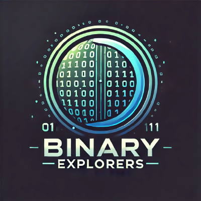

<p align="center">
  
</p>

<div align="center">

# ⚡ Binary Explorers ⚡
### `> Initializing Future Tech Leaders...`
### `> VCET 2027 Batch Assembly Complete ✓`

</div>

---

<p align="center">
  
</p>


<p align="center">
  
</p>

<div align="center">

```ascii
╔═══════════════════════════════════════════════════════════╗
║  🚀 Hey VCET 2027 Squad! Welcome to our tech Organization! ║  
║     This is where we code, collaborate & create magic    ║
╚═══════════════════════════════════════════════════════════╝
```

</div>

## 🌟 What's This All About?

Yo! We're your friendly neighborhood code enthusiasts who believe in **exploring every bit** of computer science together. Think of this as our digital hangout where we:

<table>
<tr>
<td width="50%">

### 🔥 **Build Cool Stuff**
- Mini projects that actually matter
- Fork awesome repos for everyone
- College assignments? Bring 'em here!
- Personal projects? Even better!

</td>
<td width="50%">

### 🤝 **Learn Together** 
- Stuck on code? We got your back
- Share knowledge like pros
- Collaborate on epic projects
- Level up as a team

</td>
</tr>
</table>

---

<div align="center">

## 🚀 Jump In & Start Creating


</div>


**Just do these:**
- ⭐ **Star our repos** → Stay in the loop
- 💬 **Start discussions** → Share your thoughts  
- 🔀 **Fork cool projects** → Learn from the best
- 🚀 **Create something** → Show your skills
- 🤝 **Help others** → Build together

---

<div align="center">

## 🎯 Why You'll Love It Here


</div>

<div align="center">

| 🎓 **College Life++** | 🚀 **Future Ready** | 🤝 **Squad Goals** |
|:---:|:---:|:---:|
| All your college coding in one place | Build portfolio projects | Never code alone again |
| Easy collaboration with classmates | Learn cutting-edge tech | Get help when stuck |
| Share resources with everyone | Real-world experience | Make lifelong connections |

</div>

---

<div align="center">

## 🛸 Tech Stack We Love

<p>
  
</p>
<p>
  
</p>

</div>

---

<div align="center">

### 💫 **Trust me, joining this org = best decision ever!**


```
 ██████╗ ██╗███╗   ██╗ █████╗ ██████╗ ██╗   ██╗
 ██╔══██╗██║████╗  ██║██╔══██╗██╔══██╗╚██╗ ██╔╝
 ██████╔╝██║██╔██╗ ██║███████║██████╔╝ ╚████╔╝ 
 ██╔══██╗██║██║╚██╗██║██╔══██║██╔══██╗  ╚██╔╝  
 ██████╔╝██║██║ ╚████║██║  ██║██║  ██║   ██║   
 ╚═════╝ ╚═╝╚═╝  ╚═══╝╚═╝  ╚═╝╚═╝  ╚═╝   ╚═╝   
 ███████╗██╗  ██╗██████╗ ██╗      ██████╗ ██████╗ ███████╗██████╗ ███████╗
 ██╔════╝╚██╗██╔╝██╔══██╗██║     ██╔═══██╗██╔══██╗██╔════╝██╔══██╗██╔════╝
 █████╗   ╚███╔╝ ██████╔╝██║     ██║   ██║██████╔╝█████╗  ██████╔╝███████╗
 ██╔══╝   ██╔██╗ ██╔═══╝ ██║     ██║   ██║██╔══██╗██╔══╝  ██╔══██╗╚════██║
 ███████╗██╔╝ ██╗██║     ███████╗╚██████╔╝██║  ██║███████╗██║  ██║███████║
 ╚══════╝╚═╝  ╚═╝╚═╝     ╚══════╝ ╚═════╝ ╚═╝  ╚═╝╚══════╝╚═╝  ╚═╝╚══════╝
```

</div>

---

<div align="center">

**🔗 Ready to explore? Let's code the future together!**

<a href="https://github.com/BinaryExplorers">
  
</a>


**Made with 💙 by VCET 2027 Batch | Powered by Coffee & Code ☕**

</div>
